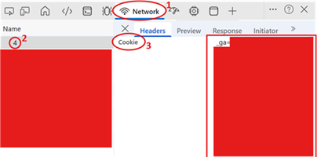

# 🎄 Advent of Code Solutions <!-- sum of stars 1: begin -->(⭐ 272)<!-- sum of stars 1: end --> and CLI 🎄

[](<https://buymeacoffee.com/jromero132> "Buy Me a Coffee - jromero132")
[](<https://adventofcode.com/> "Advent of Code homepage")
[](<https://python.org> "Go to Python homepage")


---
<!-- Badges of stars: begin -->
[](https://adventofcode.com/2015)
[](https://adventofcode.com/2016)
[](https://adventofcode.com/2017)
[](https://adventofcode.com/2018)
[](https://adventofcode.com/2019)
[](https://adventofcode.com/2020)  
[](https://adventofcode.com/2021)
[](https://adventofcode.com/2022)
[](https://adventofcode.com/2023)
[](https://adventofcode.com/2024)
[](https://adventofcode.com/2025)
<!-- Badges of stars: end -->
---
This project contains all my solutions <!-- sum of stars 2: begin -->(⭐ 272)<!-- sum of stars 2: end --> for
[Advent of Code](https://adventofcode.com/) challenges.

> [!TIP]
> If you are interested in other repositories containing solutions, you can check this compendium: <https://github.com/jromero132/really-awesome-advent-of-code>.

> [!WARNING]
> Note that ***this project can automatically download tasks and inputs and submit your solutions*** to the Advent of
> Code server. Please use it moderately.

A brief introduction taken from the website:
> Advent of Code is an Advent calendar of small programming puzzles for a variety of skill sets and skill levels that
> can be solved in any programming language you like. People use them as interview prep, company training, university
> coursework, practice problems, a speed contest, or to challenge each other.

In addition, this project contains a command-line application for managing, testing, solving and submitting
Advent of Code challenges. This tool allows users to create challenge setups, run tests, generate
test files, and provides solutions for various tasks.

> [!IMPORTANT]
> Take into account that if all tests passed and you select the option `-a` or `--answer` then
> the puzzle will be solved, and the output will be copied to the clipboard, so it can be
> easily pasted in the Advent of Code website. Also note that if you select the option
> `-s` or `--submit` then this answer will be automatically submitted to the Advent of Code
> server and you will get a console message to let you know whether you answered the task
> correctly or not 😄

## Table of Contents

<!-- no toc -->
- [Advent of Code Solutions and CLI](#-advent-of-code-solutions--and-cli-)
    - [Stats](#-stats)
    - [Features](#features)
    - [Installation](#installation)
    - [Usage](#usage)
        - [Commands](#commands)
    - [Solutions](#solutions)
        - [Directory Structure](#directory-structure)
    - [Contributing](#contributing)
    - [License](#license)

## 🎄 Stats

From 2015 to 2024, the Advent of Code calendar had `25` challenges with `2` tasks per challenge, earning you up to `50`
stars ⭐️ per year. Starting from 2025, it will have `12` challenges per year, for a maximum of `24` stars annually.

<!-- Table summary of years: begin -->
| Year | Stars | Advent of Code Link |
| :--: | :---: | :--: |
| [2015](year/2015) | ⭐️20  | https://adventofcode.com/2015 |
| [2016](year/2016) | ⭐️20  | https://adventofcode.com/2016 |
| [2017](year/2017) | ⭐️20  | https://adventofcode.com/2017 |
| [2018](year/2018) | ⭐️20  | https://adventofcode.com/2018 |
| [2019](year/2019) | ⭐️20  | https://adventofcode.com/2019 |
| [2020](year/2020) | ⭐️20  | https://adventofcode.com/2020 |
| [2021](year/2021) | ⭐️20  | https://adventofcode.com/2021 |
| [2022](year/2022) | ⭐️28  | https://adventofcode.com/2022 |
| [2023](year/2023) | ⭐️44  | https://adventofcode.com/2023 |
| [2024](year/2024) | ⭐️50  | https://adventofcode.com/2024 |
| [2025](year/2025) | ⭐️10  | https://adventofcode.com/2025 |
<!-- Table summary of years: end -->

## Features

- **Solutions**: Includes implementations for solving Advent of Code challenges.
- **Create Challenges**: Set up new Advent of Code challenges for a specified year and day.
- **Generate Test Files**: Create multiple test files for a given task.
- **Run Tests**: Execute tests for specific tasks with options to continue on failure and solve the
task in case all tests passed. Take into account that if the puzzle is solved, then the output will
be copied to the clipboard 😄
- **Submit Answer**: Allows you to automatically submit your answer for a specific task in the
Advent of Code challenges. This feature is essential if you who want to validate your solutions
against the official Advent of Code server without having to do it manually.

The `vscode_tasks` directory along with the `.vscode` directory enhances the development experience
for Advent of Code solutions by providing utility scripts and configurations specifically designed
for use within Visual Studio Code. This feature streamlines the process of executing and testing
solutions, making it easier to validate outputs and manage tasks. This will add a launch
configuration to run the current open file solution and 2 tasks, one for running the solution and
the other one for testing the solution.

## Installation

This application is cross-platform, so it works on Linux, MacOS and Windows. To use it, ensure you
have `Python >= 3.10` installed. Clone the repository and install the required dependencies:

```bash
git clone https://github.com/jromero132/advent-of-code
cd advent-of-code
pip install -r requirements.txt
echo "AOC_COOKIE=<your-aoc-session-cookie>" > .env
```

> [!NOTE]
> The `AOC_COOKIE` is your Advent of Code session cookie. You can search for it pressing `F12`
and going into the `Network` tab in your browser.  
>  
> *See the image below for reference:*  
> 

## Usage

The application provides several commands. Use the `--help` option with the app or any command to
see its usage.

### Commands

- `create`: Create a new Advent of Code challenge.  
  Current supported languages: (py | python) (cpp | c++)  
  *Examples:*
    * `python aoc.py create -d 13`: It creates the Python solution for day 13 of the current year.
    * `python aoc.py create -y 2021 -d 13`: It creates the Python solution for day 13 of year 2021.
    * `python aoc.py create -y 2021 -d 13 -l cpp`: It creates the C++ solution for day 13 of year 2021.
&nbsp;  
&nbsp;  

- `test`: Run tests for one Advent of Code challenge.  
  Current supported languages: (py | python) (cpp | c++)  
  *Examples:*
    * `python aoc.py test -d 13`: It tests the Python solution for task 1 of day 13 of the current year.
    * `python aoc.py test -y 2021 -d 13`: It tests the Python solution for task 1 of day 13 of year 2021.
    * `python aoc.py test -y 2021 -d 13 -t 2`: It tests the Python solution for task 2 of day 13 of year 2021.
    * `python aoc.py test -y 2021 -d 13 -t 2 -l cpp`: It tests the C++ solution for task 2 of day 13 of year 2021.
&nbsp;  
&nbsp;  

- `maketests`: Create test files for one Advent of Code challenge.  
  This barely creates empty files, so, pretty much not used ;)  
  *Examples:*
    * `python aoc.py maketests -n 2 -d 13 -t 1`: It creates 2 tests for task 1 of day 13 of the current year.
    * `python aoc.py maketests -n 2 -y 2021 -d 13 -t 1`: It creates 2 tests for task 1 of day 13 of year 2021.

## Solutions

This project includes all my solutions for Advent of Code challenges. You can run the solutions
directly or use the CLI to test them against provided inputs.

### Directory Structure

Each solution is organized by year, day and task, allowing easy access to the implementations.

```tree
advent-of-code
├── ⋮
├── year
│   ├── 2015
│   │   ├── day01
│   │   │   ├── task1
│   │   │   │   ├── tests
│   │   │   │   │   ├── 01.in
│   │   │   │   │   ├── 01.out
│   │   │   │   │   └── ⋮
│   │   │   │   ├── description.md
│   │   │   │   └── main.py
│   │   │   ├── task2
│   │   │   │   └── ⋮
│   │   │   ├── task.in
│   │   │   ├── task1.out
│   │   │   └── task2.out
│   │   ├── ⋮
│   │   ├── ⋮
│   │   ├── ⋮
│   │   └── day25
│   │       └── ⋮
│   ├── ⋮
│   ├── ⋮
│   ├── ⋮
│   └── 2025
│       └── ⋮
└── ⋮
```

`year/**`: Contains subdirectories for each year of challenges. For instance, from 2015 to 2023.

`day##/**`: Contains the solutions and additional files for each specified day of the Advent of Code
challenges. The days are numbered from `01` to `25`. Inside each day directory you will find:

- `task1/**`: This directory contains the solution for the first task of the Advent of Code
challenge for a specific year and day.
    - `tests/*`: This directory contains input and output files used for validating the solutions of
    the Advent of Code tasks. It is organized to facilitate testing and comparison of the
    implemented solutions against expected results.
        - `*.in`: This file contains sample input data that can be used to test the functionality of
        the solutions.
        - `*.out`: This file contains the expected output corresponding to the input data in `*.in`.
        It serves as a reference for validating the correctness of the solution by comparing the
        actual output generated by the program against this expected result.
    - `main.py`: This file contains the implementation of the solution for the respective task. It
    processes the input data from `task.in`, `tests/*.in` or custom input provided through the
    standard input, executes the necessary logic to solve the challenge, and generates the output.
- `task2/**`: This directory contains the solution for the second task of the Advent of Code
challenge for a specific year and day. It has the same structure as the `task1` directory.
- `task.in`: This file contains my personal input data required for both tasks solutions for the
specified year and day.
- `task1.out`: This file contains my output or solution for the first task. It serves as a record
of the result generated by my implementation based on the input provided in `task.in`.
- `task2.out`: This file contains my output or solution for the second task. It serves as a record
of the result generated by my implementation based on the input provided in `task.in`.

## Contributing

Contributions are welcome! Please open an issue or submit a pull request for any improvements or bug
fixes.

## License

This project is licensed under the MIT License - see the [license](license) file for details.

### Happy Coding! 🚀
